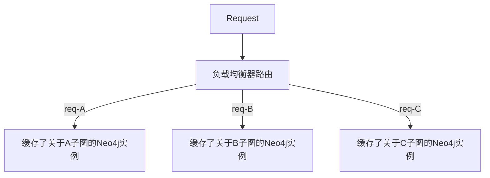

该文档记录《图数据库》读书笔记

## Chapter 1 & 2

1. 图数据库中，联系（即“有向边”）为一等公民
2. 带标签的属性图模型
   - 由节点、联系（即有向边）、属性、标签组成
   - 节点可有：
     - 标签：可以有多个，表明节点的角色
     - 属性：键值对
   - 联系（有向边）可有：
     - 方向
     - 名字：表明联系的意义
     - 起始节点和终止节点
     - 属性：给图算法提供元数据，或者增加联系的额外语义
   - *标识符
     - **仅在当前查询范围内可用**

## Chapter 3

Cypher CQL（TODO: 高级特性需要通过后文补充）

1. `MATCH`

   类似SQL的`SELECT` ，匹配用，如：

   ```cypher
   MATCH (a:Person {name:'Jim'}) -[:KNOWS]-> (b) -[:KNOWS]-> (c), (a) -[:KNOWS]-> (c) 
   RETURN b, c
   ```

   这里`MATCH`把属性`name='Jim'`的`Person`节点绑定在标识符`a`上, `b`和`c`类似..若有多个节点满足条件,则将`a`绑定到所有这些节点上

   联系表示如下：

   - 表明一个有指向的联系可用`-[relation-id:relation-name]->`或者`<-[relation-id:relation-name]-`表示，`relation-id`可省略
   - 无指向联系为`-[relation-id:relation-name]-`
   - 联系中表示长度可变：`-[relation-id:relation-name*low...up]-`/`-[relation-id:relation-name*low...up]->`（前者没规定方向，后者规定了方向）表示长度可变的路径，最小长度为`low`，最大为`up`
   - 联系中使用`|`表示“或”语义
   - `()`可表明一个匿名节点

2. `RETURN`，返回结果，最简单的查询是`MATCH & RETURN `字句，如上述样例

   - 让返回结果唯一，只需`RETURN DISTINCT <id> [AS <alias>]`即可
   - 可使用类似于SQL的聚合函数，如`count`(计数)，`length`(路径长度)，只需`RETURN count(<id>)`即可

3. `ORDER BY`

   排序，默认升序，降序只需添加`DESC`。如：`ORDER BY count_p DESC`

4. `WHERE`

   类似SQL的`WHERE`，可把上述样例改写为

   ```cypher
   MATCH (a:Person) -[:KNOWS]-> (b) -[:KNOWS]-> (c), (a) -[:KNOWS]-> (c)
   WHERE a.name = 'Jim'
   RETURN b, c
   ```

5. `CREATE`

   - 用于创建节点和联系，若单独使用，则永远会创建新节点/联系，下面是用已有的a节点，创建一个新节点b(有属性Ian)，并给2节点创建新联系

   ```cypher
   MATCH (a:Person {name:'Jim'}) 
   CREATE (a) -[:KNOWS]-> (b:Person {name:'Ian'}
   RETURN a, b
   ```

   - 若要通过已有节点和联系创建，需要搭配`MATCH`，如给以下2个已有节点创建联系，注意，**使用已有节点不需要对节点声明标签**：

   ```cypher
   MATCH (a:Person {name:'Ian'}),(b:Person {name:'Emil'}) 
   CREATE (a) -[:KNOWS]-> (b) 
   RETURN a, b
   ```

   - 创建索引，可加速查询，格式为`CREATE INDEX ON :<label>(<prop-key>)`

   ```cypher
   CREATE INDEX ON :Person(name)
   ```

   - 创建限制，如下是创建唯一的限制

   ```cypher
   CREATE CONSTRAINT ON (p:Person) ASSERT p.name IS UNIQUE
   ```

6. `MERGE`

   等效`MATCH + CREATE`。当查找时，若找到匹配断言的节点和联系，则复用，否则就直接创建。

   规则是：**用`MERGE`匹配，模式中所有的元素必须全部存在；若不能匹配所有部分，那么`MERGE`会创建一个完全模式的全新实例**

   如，若没找到`School`节点，则创建时执行`SET`动作：

   ```cypher
   MERGE {m:School {name: 'ABC'}}
   ON CREATE
          SET m.address = 'AAA'
   RETURN m
   ```

   又如，若对于已有的2节点，若关系不存在，则创建联系时执行`SET`动作（这里`MATCH`不能省略，否则当联系不存在时，2个节点都会新创建出来，即匹配必须全部满足才行，否则全部用于创建新的）：

   ```cypher
   MATCH (m:School {name:'AAA'}), (p:Person {name:'PPP'})
   MERGE (p) -[r:ACTED_IN]->(m)
   ON CREATE 
         SET r.roles = ['teacher']
   RETURN p, r, m
   ```

7. `DELETE`:删除节点和联系，要和`MATCH`字句使用

   下例是删除属性`name`为`Jim`的`Person`节点所有的邻接节点和对应的联系

   ```cypher
   MATCH (a:Person) -[r]-> (b)
   WHERE a.name = 'Jim'
   DELETE r, b
   ```

8. `REMOVE`: 删除标签和属性，同`DELETE`用法

9. `SET`：设置节点/联系的属性值，常与`MATCH`字句配合使用

   如下所示，设置节点属性：

   ```cypher
   MATCH (a:Person {name:'Ian'})
   SET a.name = 'AAA'
   RETURN a
   ```

10. `SKIP`&`LIMIT`: 分页，分别对应`offset`和`count`

11. `UNION`: 取2个`MATCH`字句的并集，若加`ALL`则结果条目会有重复

12. `IN`：判断是否属于一个集合，格式: `IN [collections-of-value]`

13. `FOREACH`: 对列表每个元素执行更新操作

14. `WITH`：链式查询，类似SQL的`WITH`，将上一步的查询结果转移到下一步查询/返回中，如

    ```cypher
    MATCH (bard:Author {lastname:'Shakespeare'}) -[w:WROTE_PLAY]-> (play)
    WITH play
    ORDER BY w.year
    RETURN collect(play.title) AS plays
    ```

建模：

- 常用名字可用作标签，如`User`,`Email`
- 带宾语动作可作为联系，如`SENT`,`WROTE`
- 合适的每次指代一个实体时，建模成节点，用属性记录它的特点
- 避免反模式（即把实体建模成联系）

## Chapter 4

### 1. 应用程序架构

**a) 嵌入式Neo4j**

优点：低延迟、任选API、显式事务；

注意点：仅用于JVM、GC行为、数据库生命周期。

嵌入式版本和服务器版本一样，可做成集群，实现高可用性和水平读扩展。

一般更新先应用于嵌入式版，如何复制到服务器版。

**b) 服务器模式**

优点：使用REST API（默认访问方式）、平台独立、扩展独立（独立于应用服务器集群来扩展数据库集群），与应用程序GC行为隔离

注意点：网络开销、事务状态（需要扩展维护事务状态，因为客户端无法完成事务时服务端依旧维护事务状态直到超时，这时候需要对API进行扩展）

**c) 服务器扩展**

对REST API进行扩展，或者取代原有的REST API

扩展优点：支持复杂事务、更好API选择、利于封装、可自定义响应格式

注意点：仅用于JVM、GC行为

### 2. 集群

Neo4j使用主从复制实现高可用性和水平读扩展

**a) 复制**

所有集群的写入都通过主节点协调完成。

可从某个节点写入，但是写入会先被同步到主节点。

而写入主节点后，主节点会将其复制到一些从节点上。(配置项`ha.tx_push_factor`和`ha.tx_push_strategy`)

建议所有写操作都通过主节点，这种操作更加快速。

**b) 使用队列写入缓冲区**

在高写入负载下，用队列来进行缓冲区写入和负载调节。

将写入缓冲到队列，如何工作节点对队列沦陷并对数据库批量写入。

优点：控制流量、降低竞争、能在不拒绝客户端请求下进行暂停写入的维护操作

(参考实习时的Micro-task框架)

### 3. 负载均衡

Neo4j本身无负载均衡功能，需要以来网络基础设施。

**a) 分离读写流量**

通过引入负载均衡器（不能单纯通过HTTP方法），将写流量定向到主节点，读流量平衡分散到整个集群

**b) 高速缓存分片**

首先是2个概念：

- 分片(Sharding): 将数据库（database）分成多个没有共同点的小型数据库，且它们可以跨多台服务器传播。其动作类似于水平分区。
- 分区(Partition): 
  - 水平分区：对表的行进行分区，如一个包含10年记录的表可被分为10个不同分区（每一年一个分区）。
  - 垂直分区：垂直划分列来减少目标表的宽度，使某些特定的列被划分到特定的分区，每个分区都包含了其中的列所对应的行。

高速缓存分片指：将请求**路由**（一致性路由技术）到HA（高可用性）集群的特定实例上，这个实例很可能已经将需要使用的图的一部分放置在了主存储器中了。（即**集群中，每个实例缓存了整个图的一部分，不同实例缓存的部分不同，类似于水平的分片**）



这提高了命中缓存的几率。

**c) 读取自己的写入**

在需要读取刚刚写入的数据时，由于写是往主节点写，读是在从节点读，可能在读取时不能反映写入的结果。

解决办法是利用b)中的路由技术，将写入操作路由到用于响应后续的读取请求的从节点上，而不是写到主节点上。

但是这种方法会慢一个数量级，应减少应用这种技术。

### 4. 容量规划

**a) 性能**

优化选项：

- JVM堆大小
- 存储映射到页缓存的存储百分比
- 存储设备（SSD等）

准则：

- 尽可能多利用页缓存，尽可能多将存储文件映射到高速缓存中
- 调整JVM堆大小，监控GC
- 考虑更高速度的存储设备

**b) 冗余**

保证可用性（即可以忍受集群中多少台机器宕机）

要通过冗余多个实例，当集群中一些实例宕机时，整个集群依旧保持可用状态

**c) 负载**

一个经验公式：

`并发请求数 = (1000/平均请求时间(ms))*每个机器内核数*机器数量`

可用于量化可扩展性（用每台机器处理多少并发请求作为每个计算量）

- 平均请求时间：对于典型数据集，从接受请求到发出响应的时间
- 并发请求数量：需要区分平均负载和峰值负载

### 5. 导入和加载数据

**a) 初始导入**

使用工具`neo4j-import`，没有支持常规事务能力，使用类栅格模式，仅当导入操作完成，存储才是一致的。

**b) 批量导入**

使用命令`LOAD CSV`

导入大量数据时，为了高效，还需考虑：

- 对已有图建立索引

  对于大量`MERGE`操作，显然从O(N)复杂度降到O(logN)，性能有大提升。

  若导入后索引不需要，可以最后删除（`DROP INDEX ON :<label>(<prop-key>)`

- 通过数据库的事务流

  Neo4j实例的更新都是事务型的，`LOAD CSV`也是。

  对大量批量导入操作，可能非常不高效，因为数据库需要管理大量事务状态

  可使用`PERIODIC COMMIT <line-no>`来将一个大的事务分解成许多连续进行的小事务提交来改善性能

## Chapter 6：内部结构

Neo4j是支持**原生图处理**和**原生图存储**的

